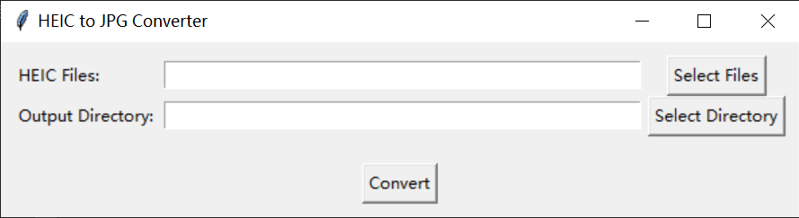

# HEIC to JPG Converter

[](https://www.python.org/downloads/)
[](LICENSE)
[]()

A simple and efficient tool for batch converting HEIC images to JPG format on Windows. This desktop application provides an easy-to-use graphical interface for converting Apple's HEIC image format to the widely compatible JPG format.

## Features

- 🖼️ **Batch Conversion**: Convert multiple HEIC files at once
- 🖱️ **User-Friendly Interface**: Intuitive GUI with simple controls
- ⚡ **Fast Processing**: Efficient conversion with minimal processing time
- 📁 **Flexible Output**: Choose your desired output directory
- 🛡️ **Error Handling**: Comprehensive error reporting for failed conversions
- 📦 **Standalone Executable**: No installation required - run directly as an executable

## Screenshots

 <!-- You would need to add actual screenshots -->

## Prerequisites

- **Windows OS** (Windows 7 or later)
- **Python 3.6+** (for running from source)

> Note: If you're using the standalone executable, Python is not required.

## Installation

### Option 1: Using the Standalone Executable (Recommended)

1. Download the latest release from the [Releases](https://github.com/your-username/heic-to-jpg-converter/releases) page
2. Extract the ZIP file
3. Run `heic_to_jpg_converter.exe`

### Option 2: Running from Source

1. Clone or download this repository
2. Install the required dependencies:
   ```bash
   pip install -r requirements.txt
   ```
3. Run the application:
   ```bash
   python heic_to_jpg_converter.py
   ```

## Usage

1. Launch the application (either the executable or Python script)
2. Click **"Select Files"** to choose the HEIC images you want to convert
3. Click **"Select Directory"** to choose where you want to save the converted JPG files
4. Click **"Convert"** to start the conversion process
5. A success message will appear when the conversion is complete

## Creating the Standalone Windows Executable

This project includes a PyInstaller spec file (`heic_to_jpg_converter.spec`) that's already configured for building a standalone Windows executable. You can use this to create a distributable version of the application.

### Prerequisites for Building

Before building the executable, ensure you have:
- Python 3.6 or later installed
- All required dependencies installed:
  ```bash
  pip install -r requirements.txt
  ```

### Building the Executable

1. Install PyInstaller:
   ```bash
   pip install pyinstaller
   ```

2. Build the executable using the provided spec file:
   ```bash
   pyinstaller heic_to_jpg_converter.spec
   ```

3. After the build process completes, find the executable in the `dist/` folder:
   - `dist/heic_to_jpg_converter.exe` - The standalone executable
   - The entire `dist/` folder contains all necessary files for distribution

### What the Spec File Does

The `heic_to_jpg_converter.spec` file is configured to:
- Bundle all required Python dependencies
- Include necessary binaries for HEIC support
- Create a single-file executable
- Hide the console window (runs as a GUI application)
- Optimize the build for Windows

### Distribution

To distribute the application:
1. Compress the entire `dist/` folder into a ZIP archive
2. Users can extract and run `heic_to_jpg_converter.exe` directly without installing Python or any dependencies

### Customizing the Build

If you need to modify the build process:
- Edit `heic_to_jpg_converter.spec` to change PyInstaller options
- You can adjust settings like:
  - Application icon (add `icon='icon.ico'` to the EXE section)
  - File version info
  - Additional files to include

## Dependencies

- [Pillow](https://python-pillow.org/) - Python Imaging Library
- [pillow-heif](https://github.com/bigcat88/pillow_heif) - HEIF plugin for Pillow

## Contributing

Contributions are welcome! Please feel free to submit a Pull Request.

1. Fork the repository
2. Create your feature branch (`git checkout -b feature/AmazingFeature`)
3. Commit your changes (`git commit -m 'Add some amazing feature'`)
4. Push to the branch (`git push origin feature/AmazingFeature`)
5. Open a Pull Request

## License

This project is licensed under the MIT License - see the [LICENSE](LICENSE) file for details.

## Acknowledgments

- Thanks to the Pillow and pillow-heif teams for their excellent libraries
- Inspired by the need to easily convert HEIC images on Windows

## Support

If you encounter any issues or have questions, please [open an issue](https://github.com/your-username/heic-to-jpg-converter/issues) on GitHub.